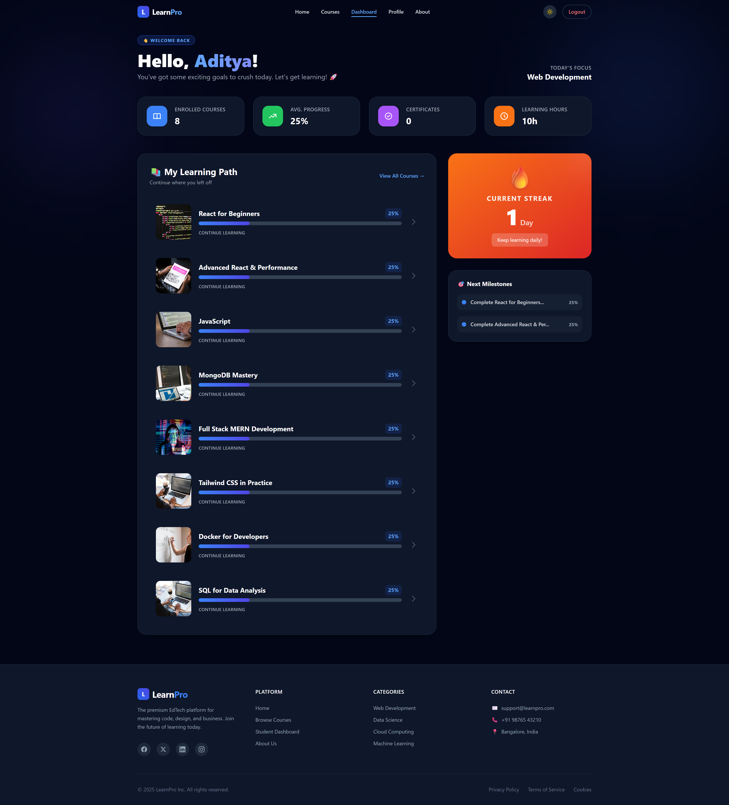
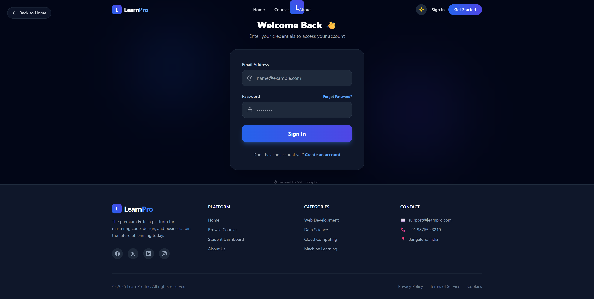
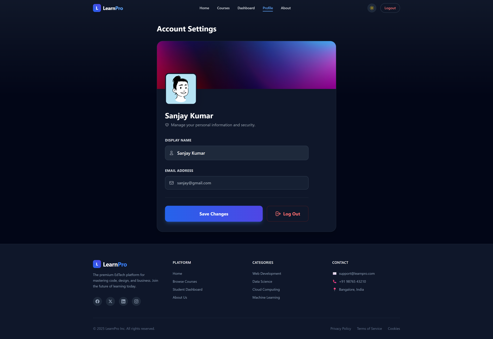

# 🎓 LearnPro – EdTech Dashboard

LearnPro is a modern EdTech dashboard built with **React**, featuring authentication, course enrollment, progress tracking, dark mode, and user profiles.

---

## 🚀 Features

- 🔐 Authentication (Signup / Login / Logout)
- 👤 User Profile Management
- 📚 Course Browsing & Enrollment
- 🧠 Per-User Progress Tracking
- 🌙 Dark Mode (Global)
- 🔒 Protected Routes
- 🔔 Toast Notifications
- ⏳ Skeleton Loaders
- 📱 Responsive UI
- 💾 LocalStorage Persistence

---

## 🛠️ Tech Stack

- **Frontend:** React, React Router
- **Styling:** Tailwind CSS
- **State Persistence:** LocalStorage
- **Notifications:** react-hot-toast
- **Icons & UI:** Custom components
- **Deployment:** Vercel / Netlify

---

## 📂 Project Structure

```plaintext
learnpro-edtech-frontend/
│
├── public/
│   ├── index.html
│   ├── logo112.png
│   └── manifest.json
│
├── src/
│   ├── assets/
│   │
│   ├── components/
│   │   ├── CourseCard.jsx
│   │   ├── CourseDetailsSkeleton.jsx
│   │   ├── Footer.jsx
│   │   ├── Loader.jsx
│   │   └── Navbar.jsx
│   │
│   ├── data/
│   │   └── courses.js
│   │
│   ├── pages/
│   │   ├── About.jsx
│   │   ├── CourseDetails.jsx
│   │   ├── Courses.jsx
│   │   ├── Dashboard.jsx
│   │   ├── Home.jsx
│   │   ├── Login.jsx
│   │   ├── NotFound.jsx
│   │   ├── Profile.jsx
│   │   └── Signup.jsx
│   │
│   ├── routes/
│   │   └── ProtectedRoutes.jsx
│   │
│   ├── utils/
│   │   └── auth.js
│   │
│   ├── App.css
│   ├── App.jsx
│   ├── index.css
│   ├── index.js
│   └── setupTests.js
│
├── .gitignore
├── package.json
├── package-lock.json
├── postcss.config.js
├── tailwind.config.js
└── README.md

```
---

## 📁 Folder Overview

- **components/** – Reusable UI components  
- **pages/** – Application pages (Routes)  
- **utils/** – Authentication & helper logic  
- **routes/** – Protected routing logic  
- **data/** – Static course data  
- **assets/** – Images and static assets  


---

# 🏗️ System Architecture Diagram
```plaintext
┌───────────────────────────────┐
│           User (Browser)      │
└───────────────┬───────────────┘
                │
                ▼
┌──────────────────────────────────────────┐
│          React SPA (LearnPro)            │
│                                          │
│  ┌──────────────┐   ┌─────────────────┐  │
│  │   App.jsx    │─▶│ React Router    │  │
│  │              │   │ (Routes Layer)  │  │
│  └──────────────┘   └─────────────────┘  │
│              │                           │
│              ▼                           │
│  ┌───────────────────────────────────┐   │
│  │          Pages Layer              │   │
│  │  Home | Courses | CourseDetails   │   │
│  │  Login | Signup | Dashboard       │   │
│  │  Profile | About | NotFound       │   │
│  └───────────────────────────────────┘   │
│              │                           │
│              ▼                           │
│  ┌────────────────────────────────────┐  │
│  │        Components Layer            │  │
│  │  Navbar | Footer | CourseCard      │  │
│  │  Loader | Skeleton | ProtectedRoute│  │
│  └────────────────────────────────────┘  │
│              │                           │
│              ▼                           │
│  ┌───────────────────────────────────┐   │
│  │        Utils / State Layer        │   │
│  │  auth.js                          │   │
│  │  • signupUser                     │   │
│  │  • loginUser                      │   │ 
│  │  • logoutUser                     │   │
│  │  • getUser / isAuthenticated      │   │
│  └───────────────────────────────────┘   │
│              │                           │
│              ▼                           │
│  ┌───────────────────────────────────┐   │
│  │      Browser Storage Layer        │   │
│  │  localStorage                     │   │
│  │  • users                          │   │
│  │  • currentUser                    │   │
│  │  • enrolledCourses_<email>        │   │
│  │  • courseProgress_<email>         │   │
│  └───────────────────────────────────┘   │
└──────────────────────────────────────────┘

```

## 🔐 Authentication Logic

- Users stored in LocalStorage
- Per-user enrollments & progress
- Protected routes with redirect memory
- Logout clears user-specific data

---

## 🧪 Demo Credentials

Create your own account using Signup  
or use any test credentials.

---

## 🌍 Live Demo

🔗 **Live URL:** _(add after deployment)_

---

## 📸 Screenshots

### 🏠 Homepage


The landing page introduces **LearnPro**, showcasing featured courses, platform statistics, and clear navigation for learners.

### 📊 Dashboard


The personalized dashboard displays enrolled courses, learning progress, statistics, and the learner’s activity streak.

### 🔐 Login Page


Secure authentication page allowing users to log in using saved credentials with validation and toast feedback.

### 📚 Courses Page


Browse all available courses with filtering, search functionality, and detailed course information.

### 👤 Profile Page


The profile page allows users to view and update their personal information, manage account details, and securely log out of the application.

### 📘 Course Details Page


Detailed course view including instructor info, syllabus highlights, enrollment status, and protected enroll functionality.

---

## 📌 Future Enhancements

- Backend integration (Node + MongoDB)
- Real course video progress
- Admin dashboard
- Payment gateway
- Certificates download

---

## 🧑‍💻 Author

**Aditya**  
Full Stack Developer | React | EdTech

---

### ⭐ Support

---

If you like this project, please ⭐ star the repository. Your support helps me grow as a developer ✨

---

# ⚙️ Installation

## 🔽 Clone Repositories

### Frontend:


```bash
git clone https://github.com/aditya32193213/edtech-dashboard.git
cd edtech-dashboard-frontend
npm install
npm start
```
---
